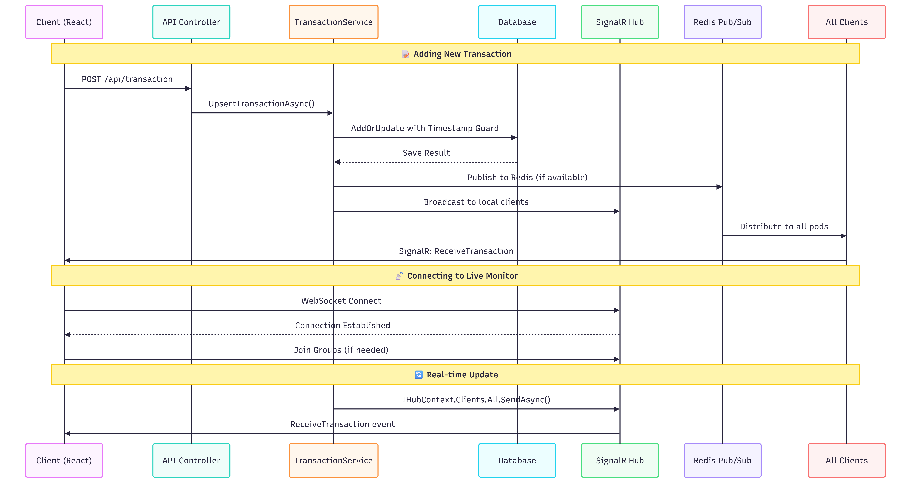

# 🏦 Real-Time Financial Monitor

## Architecture Overview

```
┌─────────────────────────────────────────────────────┐
│                   React Frontend                     │
│  /add (Simulator)         /monitor (Live Dashboard)  │
│        │                          │                  │
│   HTTP POST                  SignalR WS              │
└────────┼──────────────────────────┼─────────────────┘
         │                          │
         ▼                          │
┌─────────────────┐                 │
│  .NET 9 API     │─────────────────┘
│                 │
│  POST /api/     │──► UpsertTransactionAsync
│  transactions   │         │
│                 │    Timestamp Guard
│  SignalR Hub    │    Timestamp Guard
│    (old doesn't overwrite new)
└────────┬────────┘         │
         │              ConcurrentDictionary
         │              (MVP - in-memory)
         │
    Broadcast to
    all WS clients
```


---

## Data Flow & Request Architecture



### 🔄 Real-time Update Flow

```
TransactionService
    ↓ IHubContext.Clients.All.SendAsync()
SignalR Hub
    ↓ ReceiveTransaction event
All Connected Clients
```

### Multi-Pod Synchronization (with Redis)

```
Pod A                    Pod B                    Pod C
    ↓                        ↓                        ↓
Transaction → Redis ← Transaction ← Redis ← Transaction
    ↓                        ↓                        ↓
SignalR Broadcast    SignalR Broadcast    SignalR Broadcast
    ↓                        ↓                        ↓
Clients A              Clients B              Clients C
```

---

## Quick Start

```bash
# Backend
cd backend/FinancialMonitor.API && dotnet run

# Frontend
cd frontend && npm install && npm run dev

# Tests
cd backend/FinancialMonitor.Tests && dotnet test
```

---

## Upsert Logic & Timestamp Guard

Every POST is **upsert by UUID**:

| State | Result | HTTP |
|-----|--------|------|
| UUID new | adds | 201 Created |
| UUID exists + newer Timestamp | updates | 200 OK |
| UUID exists + **older** Timestamp | **ignored** | 200 OK |

```
Pod A receives: { id: "abc", status: Completed, timestamp: 10:00:01 }
Pod B receives: { id: "abc", status: Pending,   timestamp: 09:59:55 }  ← arrived late

Result: Completed saved ✅
```

---

## ADR: Scalability — What's missing in MVP and how to solve

### Problem 1: In-Memory Storage

**Current state (MVP):**
Data saved in `ConcurrentDictionary` in memory.

```
❌ Pod falls → all data disappears
❌ 5 Pods → each pod has separate memory
❌ Restart → complete reset
```

**Production solution:**

```
Stage 1 — SQLite (single pod):
  ITransactionService → SqliteTransactionService
  Entity Framework Core + migrations
  Already defined as interface — easy replacement!

Stage 2 — PostgreSQL (multi pod):
  All pods write to same DB
  Connection pooling (PgBouncer)
  
Stage 3 — Read/Write separation:
  Write → Primary DB
  Read  → Read Replica
```

**Why SQLite first?**
This is a 20-line change because we have `ITransactionService`.
PostgreSQL requires infra — SQLite is enough to test the logic.

---

### Problem 2: Distributed WebSocket (the classic problem)

```
5 Pods in Kubernetes:

Client A ←─ WebSocket ─→ Pod 1
Client B ←─ WebSocket ─→ Pod 3

Transaction arrives to Pod 2:
  ✅ Client connected to Pod 2 gets update
  ❌ Client A and B get nothing
```

**The solution: Redis Pub/Sub**

```
Pod 1 ◄── subscribe ──┐
Pod 2 ── publish ─────┤ Redis Channel: "transactions"
Pod 3 ◄── subscribe ──┘

Flow:
1. Transaction arrives to Pod 2
2. Pod 2 saves in DB
3. Pod 2 publishes to Redis
4. All pods (including Pod 2) receive from Redis
5. Each pod broadcasts to its clients via SignalR
```

**Implementation:**
```csharp
// Program.cs
builder.Services.AddStackExchangeRedisCache(o =>
    o.Configuration = config["Redis:ConnectionString"]);

// RedisTransactionPublisher — publish after upsert
await _redis.PublishAsync("transactions", JsonSerializer.Serialize(tx));

// RedisTransactionSubscriber (BackgroundService) — subscribe and broadcast
_redis.Subscribe("transactions", async (_, msg) => {
    var tx = JsonSerializer.Deserialize<Transaction>(msg);
    await _hubContext.Clients.All.SendAsync("ReceiveTransaction", tx);
});
```

**Timestamp Guard with Redis:**
The problem: old message from Pod 3 can arrive after new message from Pod 1.
The solution: already exists in `UpsertTransactionAsync` — the timestamp protects.

---

### Problem 3: Out-of-Order Messages

```
What happens when 5 pods send messages in parallel?

Pod 1: { status: Pending,   timestamp: T+0 }
Pod 3: { status: Completed, timestamp: T+2 }  ← arrives first
Pod 2: { status: Pending,   timestamp: T+0 }  ← arrives second (older!)

Our solution:
AddOrUpdate checks timestamp before replacement.
Old doesn't overwrite new. ✅
```

---

### Comparison of Pub/Sub Solutions

| Solution | Advantage | Disadvantage | Suitable for |
|---------|-----------|-------------|-------------|
| **Redis Pub/Sub** ✅ | Simple, fast, <1ms latency | Not persistent | MVP → Production |
| **Redis Streams** | persistent, replay | More complex | If need audit log |
| **Kafka** | Durable, replay, partitions | Over-engineering | Millions events/sec |
| **RabbitMQ** | Complex routing | Ops overhead | Complex microservices |
| **Azure Service Bus** | Fully managed | Vendor lock-in, cost | Azure-native |
| **SignalR Azure** | Managed scaling | Azure dependency | Azure-only |

**Recommendation:** Redis Pub/Sub for this project. Simple, fast, easy to add to Kubernetes as sidecar.

---

## Thread Safety

### Backend
- `ConcurrentDictionary.AddOrUpdate` — atomic, no manual lock
- Timestamp comparison inside update delegate — atomic
- SignalR `IHubContext` — thread-safe Singleton

### Frontend
- `useMemo` — filter calculated only when data changes
- Limit 500 transactions — prevents memory leak
- WebSocket with auto-reconnect

---

## Kubernetes

```bash
kubectl apply -f k8s/
kubectl get pods
kubectl logs deployment/financial-monitor
```

**Session Affinity** — essential for WebSocket: ensures each client always reaches same pod.

**Note:** With Redis Pub/Sub you can remove SessionAffinity and allow true load balancing.

