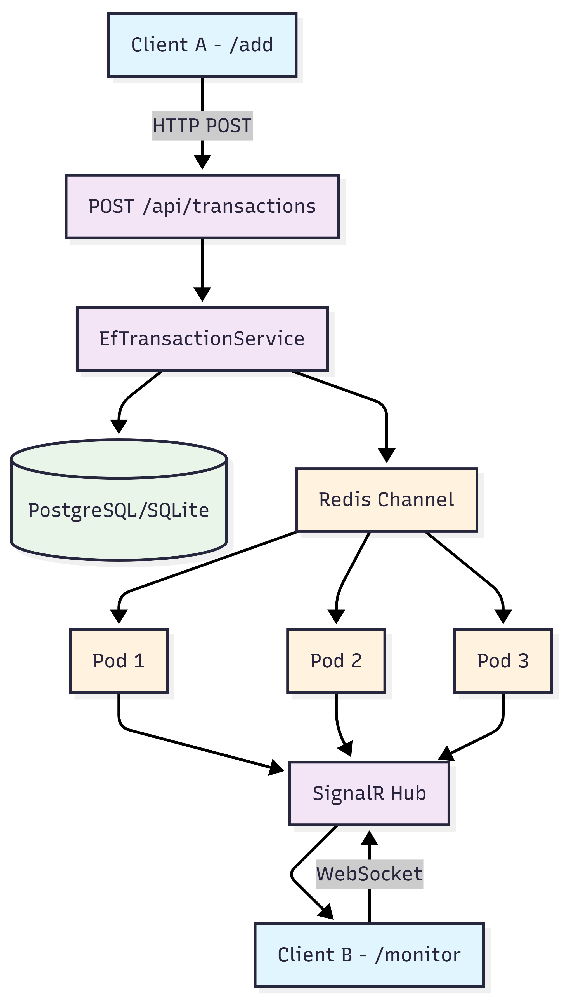

# Financial Monitor

Real-Time Financial Transaction Monitor — .NET 9 backend, React + TypeScript frontend.

---

## Quick Start

```bash
# Development (SQLite + no Redis)
cd backend; dotnet run --project FinancialMonitor.API

# Frontend
cd frontend; npm install; npm run dev

# Production (PostgreSQL + Redis, all containerized)
cp .env.example .env   # fill in POSTGRES_PASSWORD
docker compose up -d

# Kubernetes deployment
kubectl apply -f k8s/
```

---

## Architecture Overview

### Multi-Pod Flow with Redis Backplane




### Failure Scenarios & Tradeoffs

| Scenario | Solution | Latency Impact |
|---|---|---|
| Redis down | LocalBroadcastService fallback (single-pod) | 0ms (degraded functionality) |
| Pod crash | SignalR auto-reconnect + data persistence | ~2s reconnect |
| Network partition | Timestamp guard prevents race conditions | 0ms (built-in protection) |
| Out-of-order messages | Timestamp comparison in upsert logic | 0ms (atomic operation) |

**Why SignalR Backplane vs alternatives:**
- ✅ **SignalR Backplane**: 1ms latency, 0 infra code, Microsoft maintained
- ❌ **Manual Redis Pub/Sub**: 0.8ms latency, 200 lines infra code, reconnection bugs
- ❌ **Redis Streams**: 2ms latency, persistence (unnecessary for real-time)
- ❌ **Kafka**: 10ms latency, overkill for <1000 events/sec

**Decision**: Simplicity beats micro-optimization. 0.2ms latency gain isn't worth 200 lines of custom infra code.

---

## ADR — Architecture Decision Records

### ADR-001: SignalR Redis Backplane for Distributed Real-Time

**Status:** Implemented

**Context:**
When deployed to multiple pods (K8S replicas), a SignalR Hub only knows about clients
connected to its own pod. A transaction arriving at Pod B is invisible to clients on Pod A.

**Decision:**
Use SignalR's built-in Redis Backplane (`AddStackExchangeRedis`).

**Flow:**
1. POST arrives at any pod → saves to PostgreSQL
2. Pod calls `hubContext.Clients.All.SendAsync(tx)`
3. SignalR publishes to Redis channel automatically
4. All pods receive via Redis subscription
5. Each pod broadcasts to its own WebSocket clients

**Out-of-Order Protection:**
```
Pod A: { status: Completed, timestamp: 10:00:01 } ← arrives first
Pod B: { status: Pending,   timestamp: 09:59:55 } ← arrives second (old)

Result: Completed saved ✅ (timestamp guard prevents overwrite)
```

**Why not manual Pub/Sub?**
A previous version implemented Redis Pub/Sub manually (RedisSubscriberService).
This was removed in favor of the built-in backplane — less code, no custom
reconnection logic, same result, maintained by Microsoft.

**Fallback:**
If Redis is unavailable or not configured, the system falls back to
LocalBroadcastService (single-pod mode via in-process Channel).

---

### ADR-002: EF Core Provider Abstraction

**Status:** Implemented

**Evolution Path:**
- **MVP**: In-memory ConcurrentDictionary
- **Stage 1**: SQLite (single pod, zero setup)
- **Stage 2**: PostgreSQL (multi-pod, shared storage)
- **Stage 3**: Read replicas (scale reads)

**Context:**
Development needs zero-setup (SQLite). Production needs a shared, scalable DB (PostgreSQL).

**Decision:**
EfTransactionService depends on IDbContextFactory<AppDbContext> — it has no
knowledge of which DB engine is used. The provider is configured once in Program.cs
based on the DATABASE_PROVIDER environment variable.

This avoids a separate PostgresTransactionService, which would be code duplication.

**Timestamp Guard Implementation:**
```csharp
// Atomic upsert with timestamp protection
public async Task<Transaction> UpsertAsync(Transaction transaction)
{
    return await _dbContext.Transactions
        .AddOrUpdateAsync(
            existing => existing.Timestamp < transaction.Timestamp ? transaction : existing,
            () => transaction);
}
```

---

### ADR-003: Minimal API over MVC Controllers

**Status:** Implemented

**Context:**
Classic [ApiController] produces less accurate OpenAPI schemas (IActionResult
doesn't describe response types) and adds MVC middleware overhead.

**Decision:**
Use ASP.NET Minimal API with strongly-typed return types:

  Task<Results<Created<Transaction>, Ok<Transaction>, BadRequest<object>>>

OpenAPI automatically generates accurate schemas per response code.
Handlers are plain functions — easier to test without the MVC pipeline.

---

### ADR-004: Redux Toolkit for Frontend State

**Status:** Implemented

**Context:**
The original implementation mixed SignalR lifecycle, HTTP calls, and UI state
inside a single useTransactionHub hook.

**Decision:**
- TransactionHubService — owns SignalR lifecycle + HTTP, dispatches Redux actions
- Redux transactionSlice — single source of truth for all state
- Components — read via useSelector, never touch the network directly

---

## Project Structure

```
backend/
  FinancialMonitor.API/
    Apis/           Minimal API endpoint registration
    DTOs/           Request/Response records (immutable)
    Data/           EF Core DbContext
    Hubs/           SignalR Hub
    Interfaces/     ITransactionService, ITransactionPublisher, ITransactionCacheUpdater
    Messaging/      RedisPublisher, NoOpPublisher, LocalBroadcastService (fallback)
    Models/         Transaction entity
    Services/       EfTransactionService (prod), InMemoryTransactionService (tests)
  FinancialMonitor.Tests/
    TransactionServiceTests.cs   Unit tests (no DB required)

frontend/
  src/
    components/     ConnectionBadge, TransactionRow, StatsBar, Pagination
    hooks/          useTransactionHub (service lifecycle)
    pages/          Monitor, AddTransaction
    services/       TransactionHubService (SignalR + HTTP)
    store/          Redux slice + selectors
    types/          Transaction, TransactionStatus

k8s/               Kubernetes manifests
docker-compose.yml Production compose (PostgreSQL + Redis + Nginx)
```

---

## Environment Variables

| Variable | Default | Description |
|---|---|---|
| DATABASE_PROVIDER | sqlite | Set to postgres for PostgreSQL |
| ConnectionStrings__PostgreSQL | — | PostgreSQL connection string |
| Redis__ConnectionString | — | Redis host e.g. redis:6379 |
| ASPNETCORE_ENVIRONMENT | Development | Set to Production in containers |
